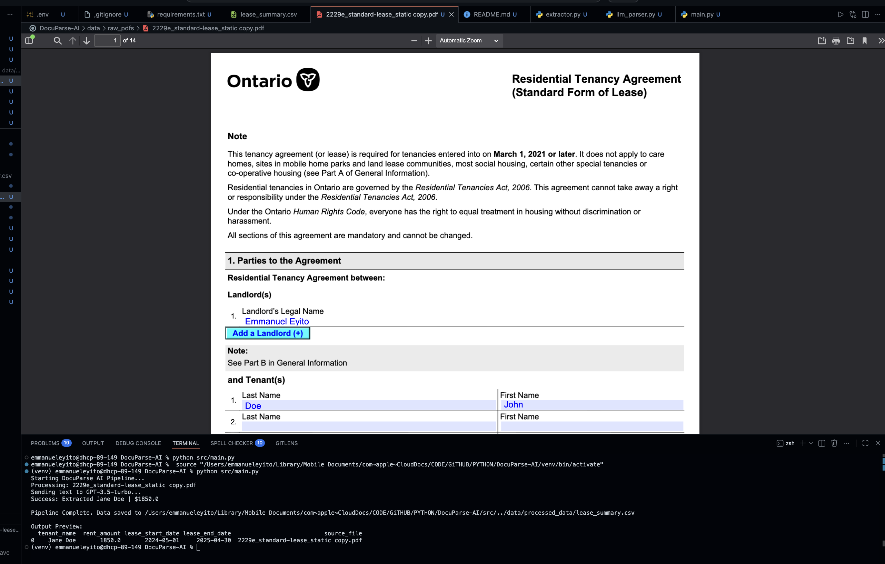

# DocuParse AI: Intelligent Lease Document Extractor
 
## Overview
An automated pipeline that ingests unstructured property lease agreements (PDFs), utilizes OCR for text extraction, and leverages GPT-based models to output structured, queryable data (JSON/CSV).

## The Engineering Challenge
Property management requires processing hundreds of non-standard lease documents. The challenge was bridging the gap between raw, messy visual data and strict, structured business intelligence. 

* **Extraction:** Utilized `PyMuPDF` to handle complex PDF layouts and text extraction.

* **Structuring:** Implemented strict JSON-schema prompting via the OpenAI API to ensure the LLM returned predictable, easily parsable variables (Tenant Name, Rent, Dates) without hallucination.

* **Automation:** Wrapped the logic in a modular Python script that batch-processes directories, converting hours of manual data entry into seconds of computation.

## Tech Stack
* Python 3.10+
* PyMuPDF (fitz)
* OpenAI API (gpt-3.5-turbo / gpt-4)
* Pandas (Data structuring & Excel export)
